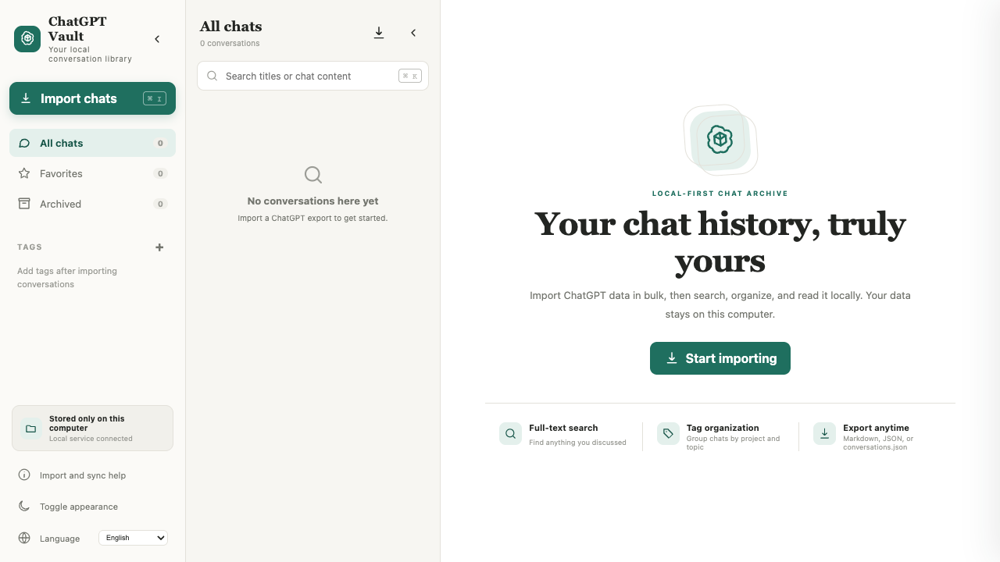

# ChatGPT Vault

> **README language:** [English](README.md) · [简体中文](docs/readme/README.zh-CN.md) · [Français](docs/readme/README.fr.md) · [Español](docs/readme/README.es.md) · [日本語](docs/readme/README.ja.md) · [العربية](docs/readme/README.ar.md) · [Deutsch](docs/readme/README.de.md) · [Italiano](docs/readme/README.it.md) · [Português](docs/readme/README.pt.md)

ChatGPT Vault is a local-first workspace for importing, searching, reading, organizing, and exporting your ChatGPT conversations. It is designed to feel closer to the ChatGPT web experience while keeping your archive on your own computer.



*A fresh ChatGPT Vault workspace—import your archive to get started.*

## What you can do

- Import the official ChatGPT ZIP or `conversations.json`.
- Import Markdown files from existing exporter scripts.
- Scan ChatGPT and selectively sync only the conversations you choose with the optional userscript.
- Search full conversation text, not only titles.
- Organize conversations with favorites, archive state, tags, and rename.
- Collapse the left navigation and conversation list independently to give the reader more room.
- Render Markdown, code blocks, tables, block quotes, links, and LaTeX formulas locally.
- Fold tool calls, web results, uploaded text, generated files, and attachments so long content does not take over the page.
- Recover and fold citation sources when the imported ChatGPT metadata contains URLs.
- Export one conversation as Markdown, JSON, JPG, or paginated PDF. Export the full library as an official-compatible `conversations.json`, a Markdown ZIP, or a JSON ZIP.
- Use the interface in English, 简体中文, Français, Español, 日本語, العربية, Deutsch, Italiano, or Português.

ChatGPT Vault is an independent community project and is not affiliated with OpenAI.

## The easiest way to start on macOS

The repository includes a small macOS launcher. It is an ordinary `.app` bundle whose launcher code uses only macOS built-ins (`zsh`, `osascript`, `curl`, `installer`, and `open`). It does not require a bundled desktop runtime or a separate launcher runtime.

1. Open the [GitHub repository](https://github.com/spongxia/chatgpt-vault), choose **Code → Download ZIP**, and unzip it somewhere you can keep it.
2. Keep the extracted folder together. Do not move the launcher out of the project.
3. Open `launcher/ChatGPT Vault Launcher.app`.
4. If macOS shows a security warning the first time, right-click the app, choose **Open**, and confirm.
5. The launcher checks for Node.js 18 or newer. If it is missing, choose **自动安装** in the dialog and enter your macOS administrator password when asked. You can also choose to open the official Node.js download page and install it yourself.
6. On the first run, the launcher installs the project dependency, starts the local service, and opens `http://127.0.0.1:4318` in your default browser.

The launcher does not package or hide the project. The source folder remains the application, which makes it easy to inspect, back up, or improve.

## Start it from a terminal

This is useful for development or if you are using Windows/Linux.

First check that Node.js and npm are available:

```bash
node --version
npm --version
```

Node.js 18 or newer is required. Then run:

```bash
git clone https://github.com/spongxia/chatgpt-vault.git
cd chatgpt-vault
npm install
npm start
```

Open <http://127.0.0.1:4318>. Keep that terminal window open while you use the app. Press `Ctrl-C` to stop the local service.

For development, `npm run dev` restarts the server when source files change. Run the automated checks with `npm test`.

## Import your conversations

### Official ChatGPT export

1. Request or download your ChatGPT data export.
2. In ChatGPT Vault, click **Import chats**.
3. Drop the official ZIP or its `conversations.json` file into the dialog.
4. Wait for the import summary, then select a conversation from the middle column.

You can import the same file again. Conversations are merged by their stable IDs, and local tags, favorites, and archive state are preserved where possible.

### Markdown files

Drop `.md` or `.markdown` files into the same dialog. The importer understands the Markdown format produced by the original exporter script and falls back to a readable single-message conversation for other Markdown files.

### Selective sync from ChatGPT

If you do not want to export your entire history:

1. Start ChatGPT Vault first.
2. Open **Import and sync help** in the left sidebar.
3. Open `chatgpt-vault-bridge.user.js` in Tampermonkey or Violentmonkey.
4. Return to ChatGPT and open the userscript panel.
5. Scan the remote catalog, select only the conversations you want, and click the sync button.

The userscript uses your signed-in ChatGPT page session and undocumented web endpoints. It sends only the conversations you select to the local service. If ChatGPT changes those endpoints, the panel reports an error instead of claiming that the scan completed.

## Reading and organizing

- The left column contains filters, tags, the help dialog, appearance controls, and language selection.
- The middle column contains search and the conversation list. It has no artificial sorting control or per-chat AI avatar.
- The right column is the reader. Use the toolbar to favorite, export, rename, tag, archive, or delete the current conversation.
- The two collapse buttons work independently. This is useful when you want the reader to occupy most of the window.
- Citation groups, tool output, uploaded files, and generated files can be opened when you need their details.
- Formulas are rendered with local KaTeX assets; they do not require a network request after installation.

## Data, privacy, and backups

The local Node service stores normalized conversations as readable JSON files under:

```text
data/conversations
```

That directory is intentionally ignored by Git. It is never included in the public repository. The app does not upload your archive to a ChatGPT Vault server, and it does not need an API key.

To use a different storage directory when starting from a terminal:

```bash
CHATGPT_VAULT_DATA_DIR=/path/to/my/conversations npm start
```

For a simple backup, stop the service and copy the entire `data/conversations` directory to another disk. You can also use **Export conversations.json** inside the app to create a portable official-compatible backup.

The optional userscript is different: it reads data from the ChatGPT page you are currently signed into, because that is how selective sync works. Review the script before installing it if you want to audit every request.

## Troubleshooting

### “Node.js is missing”

Install Node.js 18 or newer with the macOS launcher’s **自动安装** option, or install it from the [official Node.js download page](https://nodejs.org/en/download/). Close and reopen the launcher after installation.

### The browser says it cannot connect

Make sure the service is running. From the project directory, run:

```bash
npm start
```

Then open <http://127.0.0.1:4318> manually.

### Port 4318 is already in use

Find the process listening on the port:

```bash
lsof -nP -iTCP:4318 -sTCP:LISTEN
```

Stop that process if it is an old ChatGPT Vault instance, then start the launcher again. If it is another application, start ChatGPT Vault on a different port for terminal use:

```bash
PORT=4320 npm start
```

The optional userscript is configured for port 4318 by default, so update its local service address if you change the port.

### Import fails

Confirm that the official archive contains `conversations.json`. For a very large export, wait for the progress message to finish and check the launcher log at `data/chatgpt-vault-launcher.log`. You can also try importing the extracted JSON directly instead of the ZIP.

### macOS blocks the launcher

The launcher is not code-signed. Right-click `ChatGPT Vault Launcher.app`, choose **Open**, and confirm. Keep the app bundle inside the repository’s `launcher/` directory.

## Project layout

```text
chatgpt-vault/
├── launcher/                 # macOS zero-dependency launcher
├── public/                   # HTML, CSS, UI logic, renderer, and translations
├── lib/                      # Conversation normalization and export logic
├── scripts/                  # Optional ChatGPT selective-sync userscript
├── server.mjs                # Local HTTP service
├── test/                     # Node.js test suite
└── docs/                     # Screenshots and translated README files
```

## Welcome improvements

Suggestions, bug reports, documentation fixes, accessibility improvements, translations, and renderer improvements are welcome.

Before opening a pull request:

```bash
npm install
npm test
```

Please keep personal conversation exports, screenshots containing private information, `data/`, and generated build artifacts out of commits. For larger changes, open an issue first so the behavior and privacy implications can be discussed.

## License

MIT. See [LICENSE](LICENSE).
