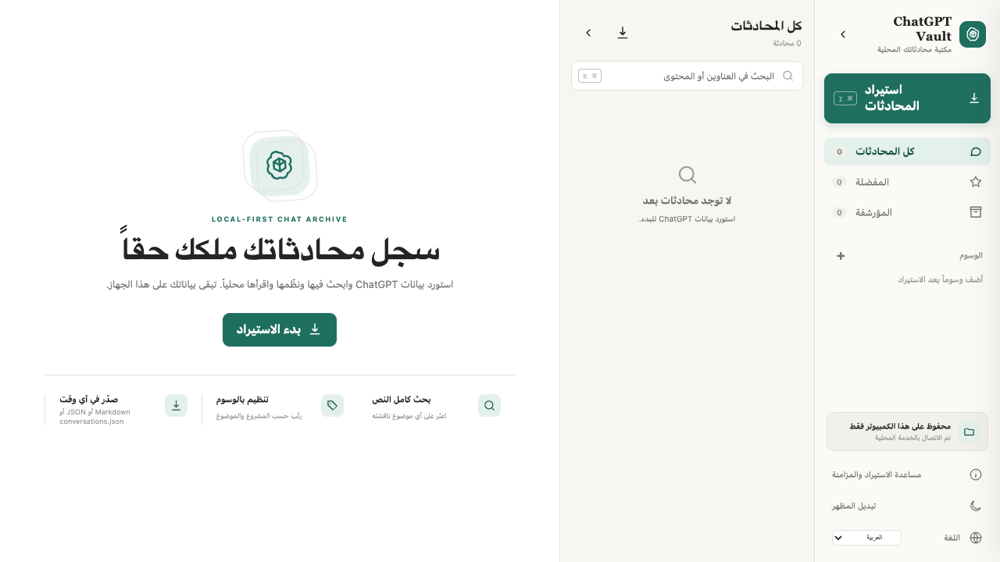

# ChatGPT Vault

> **لغة README:** [English](../../README.md) · [简体中文](README.zh-CN.md) · [Français](README.fr.md) · [Español](README.es.md) · [日本語](README.ja.md) · [العربية](README.ar.md) · [Deutsch](README.de.md) · [Italiano](README.it.md) · [Português](README.pt.md)



ChatGPT Vault هو أرشيف محلي متعدد اللغات لإدارة محادثات ChatGPT. يعرض Markdown وLaTeX، ويطوي مخرجات الأدوات والملفات المرفوعة، ويدعم المزامنة الانتقائية وتصدير `conversations.json` المتوافق مع التنسيق الرسمي.

هذا مشروع مجتمعي مستقل وغير تابع لـ OpenAI.

## المزايا

- تخزين JSON محلي بلا قاعدة بيانات سحابية أو مفتاح API.
- واجهة من ثلاثة أعمدة مع إمكانية طي شريط التنقل وقائمة المحادثات بشكل مستقل.
- عرض Markdown وLaTeX والكود والجداول والروابط والمرفقات وKaTeX المحلي.
- طي نتائج الويب والنصوص الطويلة واستدعاءات الأدوات والملفات المُنشأة.
- سكربت Tampermonkey/Violentmonkey للمزامنة الانتقائية التدريجية.
- بحث ومفضلة وأرشفة وإعادة تسمية ووسوم ووضع داكن وتخطيط RTL عربي.

## البدء السريع

يتطلب Node.js 18 أو أحدث:

```bash
npm install
npm start
```

افتح <http://127.0.0.1:4318>. تُحفظ البيانات افتراضياً في `data/conversations`.

## التطوير

```bash
npm test
npm run dev
```

تُحفظ البيانات افتراضياً في `data/conversations`. لا يحتوي المستودع على محادثاتك أو مرفقاتك أو لقطات الشاشة أو مجلد `data/` أو ملفات البناء المحلية. الترخيص MIT.
