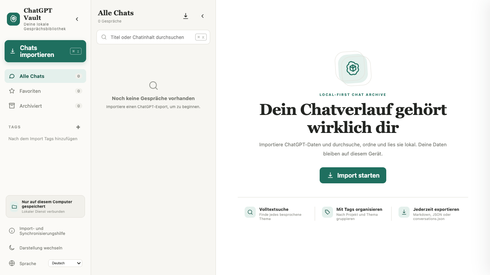

# ChatGPT Vault

> **README-Sprache:** [English](../../README.md) · [简体中文](README.zh-CN.md) · [Français](README.fr.md) · [Español](README.es.md) · [日本語](README.ja.md) · [العربية](README.ar.md) · [Deutsch](README.de.md) · [Italiano](README.it.md) · [Português](README.pt.md)



*Ein frischer ChatGPT-Vault-Arbeitsbereich – importiere deinen Verlauf und leg los.*

ChatGPT Vault ist ein lokales, mehrsprachiges Archiv zur Verwaltung von ChatGPT-Gesprächen. Markdown und LaTeX werden gerendert; Werkzeugausgaben und Uploads werden eingeklappt. Selektive Synchronisierung und ein offizielles kompatibles `conversations.json` werden unterstützt.

Ein unabhängiges Community-Projekt ohne Verbindung zu OpenAI.

## Funktionen

- Lokale JSON-Speicherung ohne Cloud-Datenbank oder API-Schlüssel.
- Drei Spalten mit separat einklappbarer Navigation und Chatliste.
- Markdown, LaTeX, Code, Tabellen, Links, Anhänge und lokales KaTeX.
- Webresultate, lange Texte, Tool-Aufrufe und erzeugte Dateien werden eingeklappt.
- Userscript für ausgewählte inkrementelle Synchronisierung.
- Suche, Favoriten, Archiv, Umbenennen, Tags, Dark Mode und arabisches RTL.
- Einzelne Gespräche als Markdown, JSON, JPG-Langbild oder PDF; die gesamte Bibliothek als `conversations.json`, Markdown-ZIP oder JSON-ZIP.

## Schnellstart

Node.js 18+ erforderlich:

```bash
npm install
npm start
```

Öffne <http://127.0.0.1:4318>. Die Daten liegen standardmäßig in `data/conversations`.

## Entwicklung

```bash
npm test
npm run dev
```

Die Daten liegen standardmäßig in `data/conversations`. Das Repository enthält keine persönlichen Chats, Anhänge, Screenshots, `data/` oder lokale Build-Artefakte. MIT-Lizenz.
