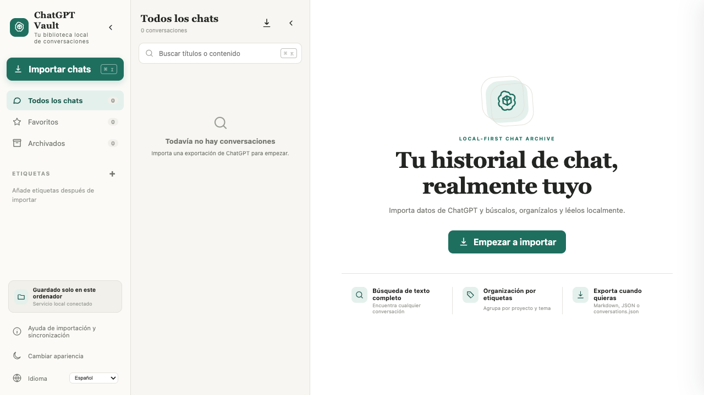

# ChatGPT Vault

> **Idioma del README:** [English](../../README.md) · [简体中文](README.zh-CN.md) · [Français](README.fr.md) · [Español](README.es.md) · [日本語](README.ja.md) · [العربية](README.ar.md) · [Deutsch](README.de.md) · [Italiano](README.it.md) · [Português](README.pt.md)



ChatGPT Vault es un archivo local y multilingüe para administrar conversaciones de ChatGPT. Renderiza Markdown y LaTeX, mantiene plegados los archivos y resultados de herramientas, permite sincronización selectiva y exporta un `conversations.json` compatible con el formato oficial.

Proyecto comunitario independiente, no afiliado a OpenAI.

## Funciones

- Almacenamiento JSON local sin base de datos en la nube ni API Key.
- Interfaz de tres columnas con navegación contraíble por separado.
- Markdown, código, tablas, citas, enlaces, adjuntos y KaTeX local.
- Resultados web, textos subidos, llamadas a herramientas y archivos generados plegados.
- Userscript para Tampermonkey/Violentmonkey con sincronización incremental seleccionada.
- Búsqueda, favoritos, archivo, renombrado, etiquetas, modo oscuro y RTL árabe.
- Exportación individual Markdown/JSON y `conversations.json` compatible.

## Inicio rápido

Requiere Node.js 18+:

```bash
npm install
npm start
```

Abre <http://127.0.0.1:4318>. Los datos se guardan por defecto en `data/conversations`.

## Sincronización selectiva

Instala `chatgpt-vault-bridge.user.js` desde la ayuda de importación, escanea las conversaciones normales y archivadas y selecciona solo las que quieras descargar.

## Desarrollo

```bash
npm test
npm run dev
```

Los datos se guardan por defecto en `data/conversations`. El repositorio no contiene conversaciones personales, adjuntos, capturas, `data/` ni artefactos locales. Licencia MIT.
