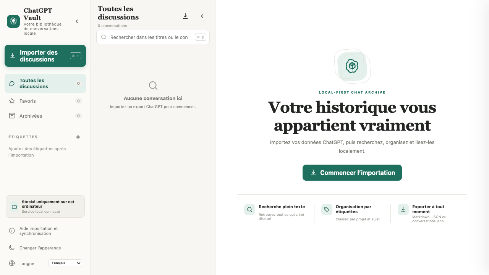

# ChatGPT Vault

> **Langue du README :** [English](../../README.md) · [简体中文](README.zh-CN.md) · [Français](README.fr.md) · [Español](README.es.md) · [日本語](README.ja.md) · [العربية](README.ar.md) · [Deutsch](README.de.md) · [Italiano](README.it.md) · [Português](README.pt.md)



*Un espace ChatGPT Vault vierge : importez votre historique pour commencer.*

ChatGPT Vault est une archive locale et multilingue pour gérer les conversations ChatGPT. L’application rend le Markdown et LaTeX, replie les outils et les fichiers importés, permet une synchronisation sélective et exporte un `conversations.json` compatible avec le format officiel.

Projet communautaire indépendant, sans affiliation avec OpenAI.

## Fonctionnalités

- Stockage JSON local, sans base de données distante ni clé API.
- Interface de lecture en trois colonnes avec navigation repliable séparément.
- Markdown, code, tableaux, citations, liens, pièces jointes et KaTeX local.
- Sorties d’outils, recherches Web, textes importés et fichiers générés repliés.
- Userscript Tampermonkey/Violentmonkey pour une synchronisation incrémentielle choisie.
- Recherche, favoris, archivage, renommage, étiquettes, thème sombre et RTL arabe.
- Export Markdown/JSON individuel et `conversations.json` officiel compatible.

## Démarrage

Node.js 18+ est requis :

```bash
npm install
npm start
```

Ouvrez <http://127.0.0.1:4318>. Le dossier de données par défaut est `data/conversations`.

## Synchronisation sélective

Installez `chatgpt-vault-bridge.user.js` depuis l’aide d’importation. Analysez les conversations normales et archivées, puis sélectionnez uniquement celles à télécharger.

## Développement

```bash
npm test
npm run dev
```

Les données sont enregistrées par défaut dans `data/conversations`. Le dépôt n’inclut jamais vos conversations personnelles, pièces jointes, captures, `data/` ou artefacts de build. Licence MIT.
