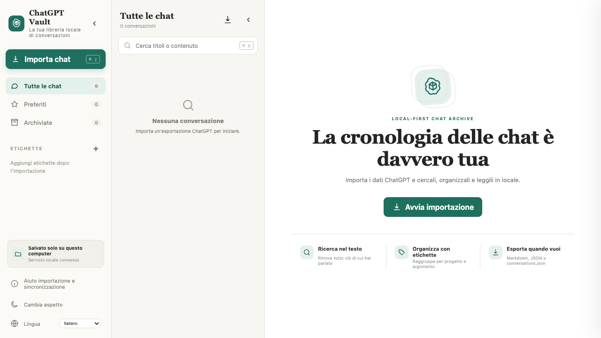

# ChatGPT Vault

> **Lingua del README:** [English](../../README.md) · [简体中文](README.zh-CN.md) · [Français](README.fr.md) · [Español](README.es.md) · [日本語](README.ja.md) · [العربية](README.ar.md) · [Deutsch](README.de.md) · [Italiano](README.it.md) · [Português](README.pt.md)



ChatGPT Vault è un archivio locale e multilingue per gestire le conversazioni ChatGPT. Visualizza Markdown e LaTeX, comprime gli output degli strumenti e i file caricati, supporta la sincronizzazione selettiva ed esporta un `conversations.json` compatibile con il formato ufficiale.

Progetto comunitario indipendente, non affiliato a OpenAI.

## Funzionalità

- Archiviazione JSON locale senza database cloud né API Key.
- Interfaccia a tre colonne con navigazione e lista comprimibili separatamente.
- Markdown, LaTeX, codice, tabelle, citazioni, link, allegati e KaTeX locale.
- Risultati web, testi lunghi, chiamate agli strumenti e file generati compressi.
- Userscript Tampermonkey/Violentmonkey per la sincronizzazione selettiva.
- Ricerca, preferiti, archivio, rinomina, etichette, tema scuro e RTL arabo.
- Esportazione Markdown/JSON e `conversations.json` compatibile.

## Avvio rapido

Richiede Node.js 18+:

```bash
npm install
npm start
```

Apri <http://127.0.0.1:4318>. I dati vengono salvati in `data/conversations`.

## Sviluppo

```bash
npm test
npm run dev
```

I dati vengono salvati per impostazione predefinita in `data/conversations`. Il repository non contiene chat personali, allegati, screenshot, `data/` o artefatti locali. Licenza MIT.
