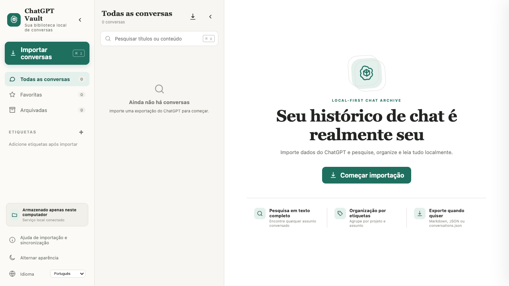

# ChatGPT Vault

> **Idioma do README:** [English](../../README.md) · [简体中文](README.zh-CN.md) · [Français](README.fr.md) · [Español](README.es.md) · [日本語](README.ja.md) · [العربية](README.ar.md) · [Deutsch](README.de.md) · [Italiano](README.it.md) · [Português](README.pt.md)



*Um espaço de trabalho novo do ChatGPT Vault — importe seu histórico para começar.*

ChatGPT Vault é um arquivo local e multilíngue para gerenciar conversas do ChatGPT. Renderiza Markdown e LaTeX, mantém resultados de ferramentas e arquivos enviados recolhidos, oferece sincronização seletiva e exporta um `conversations.json` compatível com o formato oficial.

Projeto comunitário independente, sem vínculo com a OpenAI.

## Recursos

- Armazenamento JSON local sem banco de dados na nuvem nem API Key.
- Interface de três colunas com navegação e lista recolhíveis separadamente.
- Markdown, LaTeX, código, tabelas, citações, links, anexos e KaTeX local.
- Resultados web, textos longos, chamadas de ferramentas e arquivos gerados recolhidos.
- Userscript Tampermonkey/Violentmonkey para sincronização incremental selecionada.
- Pesquisa, favoritos, arquivo, renomear, etiquetas, modo escuro e RTL árabe.
- Exportação individual em Markdown, JSON, imagem JPG ou PDF paginado; biblioteca completa em `conversations.json`, ZIP Markdown ou ZIP JSON.

## Início rápido

Requer Node.js 18+:

```bash
npm install
npm start
```

Abra <http://127.0.0.1:4318>. Os dados são salvos em `data/conversations`.

## Desenvolvimento

```bash
npm test
npm run dev
```

Os dados são salvos por padrão em `data/conversations`. O repositório não inclui conversas pessoais, anexos, capturas, `data/` ou artefatos locais. Licença MIT.
